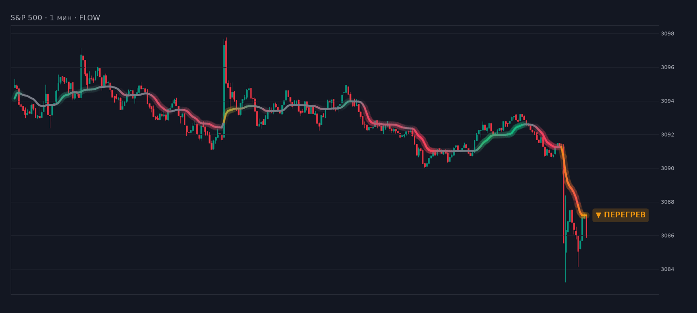

# Индикаторы для TradingView

| файл | что это |
|---|---|
| `pine/FLOW.pine` | **FLOW** — одна линия тренда: направление, сила, флэт и перегрев. Сделан под 1 минуту |
| `pine/SPRING.pine`, `pine/SPRING_strategy.pine` | **SPRING** — движок отскоков: скор, план сделки, калибровка (описан ниже) |

---

# FLOW — одна линия тренда

На графике одна линия, больше ничего. По ней видно, есть ли тренд, насколько он силён
и не пора ли перестать ловить продолжение.



<sub>Реальные минутки S&P 500. Значения и цвета посчитаны этим же Pine-скриптом (через PineTS),
картинка отрисована отдельно, это не скриншот TradingView.</sub>

## Как читать

| линия | что происходит | что делать |
|---|---|---|
| **зелёная**, ярко и со свечением | сильный тренд вверх | ловить продолжение: лонг на откате к линии |
| **красная**, ярко и со свечением | сильный тренд вниз | ловить продолжение: шорт на откате к линии |
| цвет **бледнеет** | тренд теряет силу | продолжение уже не ловить, готовиться к развороту или флэту |
| **серая**, почти плоская | флэт, тренда нет | продолжение не работает: работать от границ или ждать |
| **янтарная / оранжевая** | перегрев: цена убежала от линии, а импульс уже гаснет | не догонять; ждать отката к линии или искать разворот |

Яркость — это сила тренда: чем насыщеннее цвет и заметнее свечение, тем сильнее тренд.
Цвет меняется плавно, поэтому переход тренд → флэт → разворот виден заранее: линия сначала
тускнеет до серой и только потом перекрашивается в другую сторону.

Сама линия — ещё и уровень. На живом тренде цена откатывает к ней и отталкивается, это и есть
точка входа по тренду. Пробой линии против цвета — первый признак, что тренд ломается.

**Метка на конце линии** — одно слово: `▲ ТРЕНД 72%`, `▼ СЛАБЕЕТ 28%`, `● ФЛЭТ`, `▼ ПЕРЕГРЕВ`.
Если навести на неё курсор, всплывёт подсказка: что делать, сила тренда, направление старшего
тренда и насколько цена сейчас далеко от линии. Метку можно выключить в настройках, тогда
останется только линия.

## Установка

1. TradingView → **Pine Editor** (внизу экрана) → **Открыть → Новый индикатор**.
2. Удалить заготовку, вставить содержимое `pine/FLOW.pine`, **Сохранить**, **Добавить на график**.
3. Линия рисуется прямо поверх свечей. Если на графике висят другие средние — их лучше убрать,
   FLOW их заменяет.

## Настройки

Крутить стоит только первую группу, остальное подобрано под 1 минуту.

| параметр | по умолчанию | зачем |
|---|---|---|
| **Период** | 10 | главная ручка. Меньше — линия быстрее и чаще меняет цвет, больше — плавнее. Для 1 минуты 8–14 |
| **Плавность** | 4 | сглаживание линии. 1 — ближе к цене, но дёрганее |
| Свечение, метка, толщина, цвета | | внешний вид. Можно покрасить свечи в цвет линии — по умолчанию выключено |
| Старший тренд, × периода | 5 | с чем сравнивается текущий ход. 5 × 10 минут ≈ тренд на 5-минутках |
| Штраф за ход против старшего тренда | 0.5 | ход против старшего тренда чаще оказывается откатом, поэтому рисуется бледнее |
| Порог тренда / флэта | 0.35 / 0.15 | когда тренд начинается и когда заканчивается. Разрыв между ними не даёт цвету дёргаться |
| Перегрев от, σ | 1.8 | насколько далеко от линии цена должна убежать, чтобы начать считать перегрев |

В **окне данных** (Data Window) есть два скрытых ряда: «Сила тренда, %» (от −100 до +100) и
«Перегрев, %». На графике их нет, но по ним удобно смотреть точные значения на любом баре.

## Алерты

Четыре условия: `FLOW · тренд вверх`, `FLOW · тренд вниз`, `FLOW · флэт`, `FLOW · перегрев`.
Плюс вызов `alert()` на любое из этих событий: тип алерта **«Любой вызов функции alert()»**,
в тексте придут тикер, событие, сила тренда и цена линии.

Ставьте на **«Раз за бар на закрытии»**, иначе состояние может мигнуть внутри бара и пропасть.

## Как считается

**Линия** — адаптивная средняя Кауфмана (KAMA) с лёгким сглаживанием Элерса. Скорость у неё
зависит от эффективности хода: когда цена идёт в одну сторону, линия быстро за ней следует,
когда мечется — почти замирает. Поэтому плоская серая линия и означает «тренда нет».

**Сила тренда** от −1 до +1 складывается из трёх вещей:

| компонент | вес | что меряет |
|---|---|---|
| эффективность хода | 0.40 | какая доля пройденного за 20 баров пути пройдена в одну сторону |
| наклон линии | 0.35 | насколько быстро идёт сама линия, в ATR за бар |
| положение цены | 0.25 | с какой стороны от линии цена и насколько далеко, в ATR |

Если ход идёт против старшего тренда (то же самое, только в 5 раз длиннее), сила урезается.
Затем она сглаживается по 3 барам, а состояние переключается с гистерезисом: тренд начинается
от 0.35 и заканчивается ниже 0.15.

**Перегрев** требует двух условий сразу:
1. цена отошла от линии дальше 1.8σ своих обычных отклонений за последние 120 баров;
2. импульс перестал расти: сила ниже пика последних 6 баров или цена не обновила экстремум.

Одного растяжения мало. В начале сильного импульса цена тоже далеко от линии, но это
продолжение, а не разворот. На прототипе вариант «только растяжение» на трёх наборах данных
из четырёх показал после сигнала продолжение *лучше* обычного, то есть был бы ложной тревогой.
Поэтому условие гашения импульса обязательно. Если цена далеко от линии, а импульс ещё идёт, метка
остаётся `ТРЕНД`, но в подсказке будет «не догонять, брать на откате к линии».

Всё считается по закрытым данным: ни `request.security`, ни заглядывания вперёд, история
не перерисовывается. На текущем незакрытом баре цвет может меняться, как у любой средней.

## Что проверено

* Логика сначала собрана прототипом на Python и прогнана на реальных минутках:
  S&P 500 (1 563 бара), две криптопары (13 681 и 2 469 баров), плюс часовой EURUSD (5 000 баров).
* Затем сам `FLOW.pine` запущен через [PineTS](https://www.npmjs.com/package/pinets)
  (исполнитель Pine v6) на минутках S&P 500 и криптопары. Линия, сила тренда, перегрев
  и состояния совпали с прототипом на всех барах после прогрева. Цены криптопары (~0.002)
  для этого прогона умножены на 10⁶: PineTS округляет результат `ta.sma` до 10 знаков,
  TradingView так не делает, а сам индикатор от масштаба цены не зависит.
* Синтаксис проверен валидатором Pine v6 (`pinescript-v6-validator`): ошибок и предупреждений нет.

## Оговорка

FLOW описывает, что происходит с трендом сейчас. Это не система входов, и эджа он не обещает.
На истории после перегрева продолжение в среднем шло хуже, чем в обычном тренде, на трёх
наборах из четырёх. Но баров перегрева в каждом наборе от десятков до пары сотен — это
подтверждает, что логика не перевёрнута, а не то, что на ней можно зарабатывать.
Решение о входе остаётся за вами и за вашим сетапом, линия лишь подсказывает, по тренду сейчас
торговать или против него.

---

# SPRING — движок отскоков

Порт движка отскоков **SPRING** на Pine Script v6: скор, состояния, готовый план сделки
и таблица калибровки прямо на графике.

```
Score = 100 · gain · G · ( 0.20·S + 0.22·P + 0.28·R + 0.13·I + 0.17·N )
```

| | компонент | что меряет |
|---|---|---|
| **S** | растяжение | насколько цена ушла от средней — одновременно в σ и в ATR |
| **P** | истощение | климакс объёма, затухание импульса, хвост свечи |
| **R** | возврат | свип уровня и реклейм — **триггер**, только текущий бар |
| **I** | дивергенция | RSI + дельта объёма (CVD) + необязательный коррелят |
| **N** | уровни | конфлюэнс EMA / VWAP / хай-лоу дня / круглого числа / фибо в допуске 0.28 ATR |
| **G** | режим | множитель 0…1: душит сетапы против сильного тренда и в разгоне волатильности |

Контекст копится на экстремуме, а триггер приходит через несколько баров. Поэтому
**S/P/I/N берутся как максимум за окно контекста, а R считается строго по текущему бару.**
Если требовать совпадения всего на одном баре, сигналов не будет вообще.

## Файлы

| файл | что делает |
|---|---|
| `pine/SPRING.pine` | индикатор: панель скора, состояния FLAT → WATCH → ARMED → TRIGGER, план сделки на графике, таблица компонентов, таблица калибровки, алерты |
| `pine/SPRING_strategy.pine` | стратегия: те же сигналы, но исполняет их движок TradingView — нативный отчёт с эквити, просадкой и списком сделок |

Ядро (компоненты, скор, план) в обоих файлах одинаковое — второй файл собран из первого,
так что правки в логике надо повторять в обоих.

## Установка

1. TradingView → **Pine Editor** (внизу экрана) → **Открыть → Новый индикатор**.
2. Удалить заготовку, вставить содержимое `pine/SPRING.pine`, **Сохранить**, **Добавить на график**.
3. Индикатор рисуется отдельной панелью снизу (скор), а план сделки и стрелки — поверх свечей.
   Панель можно растянуть за нижнюю границу, чтобы влезли таблицы.
4. Стратегию добавлять отдельным скриптом — она сама рисуется поверх графика,
   отчёт открывается вкладкой **Тестер стратегии**.

Рабочий таймфрейм — тот же, на котором считалась калибровка: 5 минут на фьючерсах и индексах.
На других инструментах и таймфреймах параметры надо пересчитывать (см. ниже).

## Как читать

**Панель.** Заливка — скор, сплошная линия — он же в цвете состояния, тонкая линия сверху —
*потенциал*: какой скор получился бы при идеальном возврате прямо сейчас. Пунктир — порог входа,
точечная линия — порог наблюдения.

**Состояния.**
* `FLAT` — торговать нечего.
* `WATCH` — контекст набирается.
* `ARMED` — контекст готов: идеальный возврат на этом баре дал бы вход. Здесь ставят лимитку.
* `TRIGGER` — скор перешёл порог, сигнал.

**План сделки** рисуется на графике при сигнале и держится, пока сделка открыта:
вход, стоп за свингом с запасом 0.5 ATR, T1 на средней, T2 = 2.6R, лимитка на ретесте
(стоп ∓ 0.3 ATR), размер позиции = скор / риск в ATR.

**Таблица компонентов** справа вверху раскладывает скор обратно на слагаемые: значение × вес = вклад.
Если сделка не нравится — видно, какая именно строка её вытянула.

## Калибровка — главное

Абсолютное значение скора само по себе не значит ничего. Значение имеет таблица справа внизу:
что каждый диапазон скора дал **на вашем инструменте**. Индикатор прогоняет симулятор по всей
видимой истории, берёт сделки от «нижнего порога для калибровки» (по умолчанию 50, а не 70 —
чтобы было видно, с какого диапазона начинается эдж) и считает по каждому диапазону сделки,
винрейт, профит-фактор, средний R и среднее число баров в сделке.

Порог входа берут не из головы, а отсюда: он ставится там, где кончается рост среднего R.
**Если винрейт и средний R не растут вместе со скором — на этом инструменте модель не работает,
какой бы стройной она ни была.** Комиссия и проскальзывание задаются полем
«Комиссия и проскальзывание, тиков на сделку» и вычитаются из каждой сделки.

Симулятор — не бэктестер: он считает по барам, при касании стопа и цели на одном баре
засчитывает стоп, и не знает про частичные исполнения. Для честного отчёта используйте
`SPRING_strategy.pine` и вкладку «Свойства» с реальной комиссией и проскальзыванием.

## Параметры, которые действительно стоит крутить

| параметр | зачем |
|---|---|
| **Средняя** (20 EMA) | цель T1 и точка отсчёта растяжения. Длиннее — реже и крупнее сетапы |
| **Окно контекста** (12) | сколько баров живёт контекст до триггера |
| **Порог входа** (70) | ставится по таблице калибровки, а не по вкусу |
| **Полное растяжение** σ / ATR (2.5 / 2.5) | что считать «далеко от средней» на вашем инструменте |
| **Климакс объёма** (2.5×) | для индексов без реального объёма — снизить или не полагаться на P |
| **Допуск конфлюэнса** (0.28 ATR) | шире — N срабатывает чаще и хуже различает |
| **Тайм-стоп** (12 баров) | средняя сделка живёт ~3 бара; тайм-стоп режет зависшие |
| **G: ER тренда** (0.20 / 0.60) | насколько сильно душить вход против тренда |

Веса компонентов вынесены в отдельную группу — их сумма должна оставаться равной 1,
иначе поедет шкала скора и порог придётся калибровать заново.

## Алерты

Три готовых условия: `SPRING · LONG`, `SPRING · SHORT`, `SPRING · любой сигнал`.
Плюс вызов `alert()` с полным планом в тексте — выбрать тип алерта
**«Любой вызов функции alert()»**, и в сообщение придёт сторона, скор, вход, стоп, T1, T2,
R:R, размер и цена лимитки на ретесте.

Ставьте алерты на **«Раз за бар на закрытии»**. При выключенной галке «Сигналы только по закрытым барам»
сигнал появляется внутри формирующегося бара и может исчезнуть — это нормальное поведение
любого триггерного скрипта, но на живых деньгах так торгуют осознанно.

## Про заглядывание в будущее

Все компоненты считаются по закрытым данным текущего бара. Хай/лоу предыдущего дня берутся
через `request.security(..., lookahead_on)` с явным сдвигом `[1]` — это штатный способ получить
вчерашние уровни без подглядывания. VWAP сессии считается вручную, а не через `ta.vwap`,
чтобы скрипт не падал на инструментах без объёма; там же, где объёма нет, компонент P
переходит на нейтральное значение, а CVD-часть дивергенции отключается.

## Оговорка

Числа из исходной презентации SPRING (3 877 сделок, профит-фактор 1.16) получены на
**синтетических** данных: генератор с переключением режимов и встроенным возвратом к средней.
Это доказывает, что механика верна и нет заглядывания в будущее, но **это не доказательство
эджа на реальном рынке** — генератор сам благосклонен к отскоковой логике.

Прежде чем ставить деньги, прогоните таблицу калибровки на своей истории и посмотрите на свою
таблицу. Компоненты здесь — добросовестная реконструкция по опубликованным определениям
(«растяжение в σ и ATR», «климакс объёма и затухание», «свип и реклейм», «конфлюэнс 0.28 ATR»),
а не побайтовый порт закрытого `assistant.py`: арифметика плана сходится с оригиналом точно,
формулы компонентов — по смыслу. Поэтому пороги и веса на вашем инструменте почти наверняка
придётся подобрать заново.
