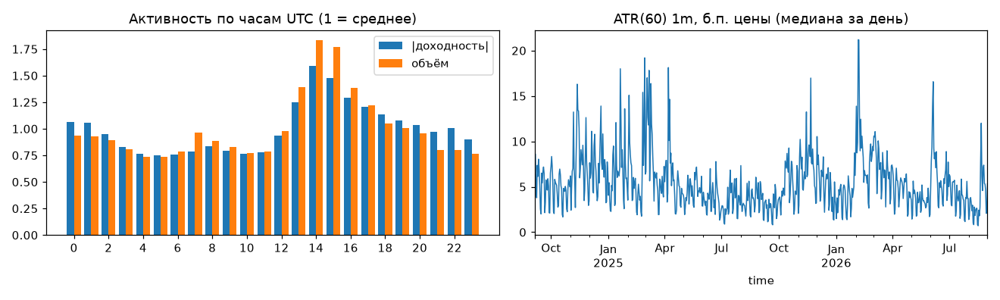

# Этап 1. Данные и отпечатки

Файл: `data/standin_BTCUSDT_1m.csv`, время в файле: UTC, время рынка: UTC

## Проверка данных

* Строк в файле: **1,051,200**, период 2024-09-01 00:00:00+00:00 — 2026-08-31 23:59:00+00:00 (UTC)
* Дублей по времени нет
* Нарушения OHLC (high < max(O,C), low > min(O,C), цена <= 0): **0**
* Подозрительные одиночные «иглы» (скачок > 15 средних минутных ходов и возврат >= 80% на следующей минуте): 12 — оставлены, список в stats['spikes']
* Плоских баров (H=L): 0.00%; с диапазоном <= 2 тиков (тик ~ 0.01): 5.37%; с нулевым/пустым объёмом: 0.00%
* Минутная сетка от первой до последней записи: 1,051,200 минут, отсутствует 0 (0.00%)
* Пропусков нет
* Баров в субботу/воскресенье (время рынка UTC): 28.63% — торговля 24/7
* Часовой пояс: время приведено к UTC. Пики волатильности по часам UTC: [14, 15, 16] (ориентиры: Лондон ~7–8 UTC, Нью-Йорк ~13–14 UTC зимой / 12–13 летом)
* После очистки: 1,051,200 минут, из них заполнено как «минута без сделок»: 0; непрерывных сегментов: 1

## Отпечатки

* Размерность отпечатка: **39** (path: 30, vol: 2, tod: 2, dayhl: 2, eff: 3)
* Минут с валидным отпечатком: 1,044,001 (99.3%); с валидным отпечатком и исходом на 15 мин: 1,043,986
* ATR(60) 1m: медиана 4.9 б.п. цены (10–90%: 2.0–12.0); в цене: медиана 42.65
* Ход за 15 мин в ATR: σ = 4.12, |ход| медиана = 2.15
* Барьер ±1.0 ATR за 15 мин (безусловно): +1 первым 49.2%, −1 первым 49.4%, оба в одной минуте 0.9%, ни один 0.6%

Сводка признаков (валидные минуты):

| признак | среднее | σ | 1% | 99% |
|---|---:|---:|---:|---:|
| p01 | -0.001 | 0.993 | -2.658 | 2.637 |
| p05 | -0.004 | 2.197 | -5.817 | 5.684 |
| p15 | -0.013 | 3.636 | -9.440 | 9.101 |
| p30 | -0.035 | 4.892 | -12.292 | 11.856 |
| p60 | -0.119 | 6.473 | -15.474 | 14.825 |
| v_short | -0.040 | 0.300 | -0.818 | 0.706 |
| v_long | -0.177 | 0.655 | -1.925 | 1.215 |
| tod_sin | -0.000 | 0.707 | -1.000 | 1.000 |
| tod_cos | 0.000 | 0.707 | -1.000 | 1.000 |
| d_hi | 2.610 | 0.890 | 0.154 | 3.932 |
| d_lo | 2.684 | 0.919 | 0.162 | 3.932 |
| eff15 | 0.269 | 0.197 | 0.004 | 0.841 |
| eff30 | 0.186 | 0.139 | 0.003 | 0.596 |
| eff60 | 0.129 | 0.096 | 0.002 | 0.418 |

Время работы: 10 с

