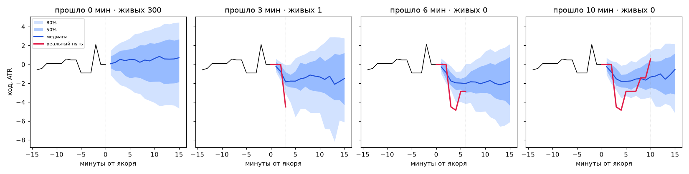

# Этап 2. Поиск аналогов и веер

* База аналогов: 999,346 минут до 2026-08-01 (исход каждой известен до начала теста)
* Индекс FAISS IndexFlatL2 (точный), размерность 39; построение 2.3 с
* Запрос: 6.6 мс на минуту (поиск 4000 кандидатов + прореживание до K=300)
* Найдено аналогов после прореживания: медиана 300, минимум 300 из 300
* Минимальный разрыв между аналогами одного запроса: 30 мин (требование >= 30)
* Эффективный размер выборки (ESS) по весам: медиана 275

## Пример: 2026-08-16 18:09 UTC

* P(+1 ATR раньше −1 ATR) = **60.5%**, P(−1 раньше) = 39.5%
* Ожидаемый ход к +15 мин: +0.24 ATR; медиана +0.71; 80% полоса [-4.66, +4.45] ATR
* Фактически: +1.67 ATR к +15 мин

5 ближайших аналогов:

| дата (UTC) | расстояние | ход к +15, ATR |
|---|---:|---:|
| 2026-05-25 17:58 | 0.613 | +4.07 |
| 2026-06-12 20:36 | 0.640 | -3.85 |
| 2024-10-27 18:33 | 0.672 | -1.07 |
| 2025-07-27 19:29 | 0.708 | +1.75 |
| 2026-05-10 18:59 | 0.731 | +4.38 |

Живое сужение (якорь зафиксирован, проходят минуты):

| прошло мин | живых (норм. RMSE<=0.5) | ESS | медиана к +15 | 80% полоса к +15 | P(+1 раньше −1)* |
|---:|---:|---:|---:|---:|---:|
| 0 | 300 | 277 | +0.71 | [-4.66, +4.45] | 60.5% |
| 3 | 1 | 55 | -1.50 | [-6.12, +2.77] | 21.3% |
| 6 | 0 | 58 | -1.81 | [-6.12, +2.14] | 12.7% |
| 10 | 0 | 84 | -0.53 | [-5.18, +2.15] | 18.7% |

\* P по аналогам с их полным исходом (для k>0 это не «с текущей цены», а от якоря).

