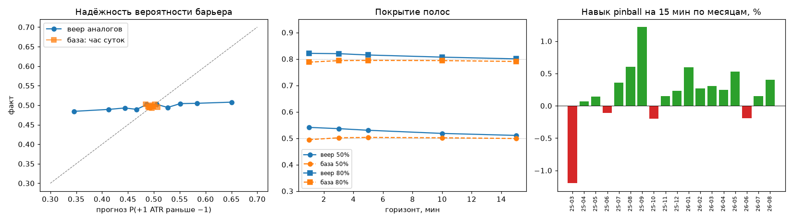

# Этап 3. Проверка walk-forward

* Тестовые месяцы: 2025-03 … 2026-08 (18 фолдов), запросов: 158,109 (каждая 5-я минута), дней: 549
* Для месяца M база аналогов и нормировка — только минуты, чей исход закрылся до начала M. Параметры метода заданы заранее и по тестовым исходам не подбирались.
* База сравнения: распределение исходов того же часа суток из той же базы (без поиска аналогов).
* Доверительные интервалы 95% — бутстрэп по дням (минуты внутри дня зависимы).

## 1. Калибровка полос веера

Доля случаев, когда реальная цена на горизонте h оказалась внутри полосы (номинал 50% и 80%).

| горизонт | веер 50% | база 50% | веер 80% | база 80% | ширина 80% веер / база |
|---|---:|---:|---:|---:|---:|
| 1 мин | 54.1% | 49.5% | 82.1% | 78.8% | 1.09 |
| 3 мин | 53.6% | 50.2% | 82.0% | 79.4% | 1.06 |
| 5 мин | 53.0% | 50.3% | 81.5% | 79.4% | 1.05 |
| 10 мин | 51.8% | 50.2% | 80.7% | 79.4% | 1.02 |
| 15 мин | 51.1% | 49.9% | 80.0% | 79.0% | 1.01 |

## 2. Веер против базы: квантильный (pinball) лосс

Собственная оценка всего распределения (усреднение по уровням 10/25/50/75/90). Навык = 1 − лосс веера / лосс базы; > 0 — веер лучше.

| горизонт | лосс веера | лосс базы | навык [95% ДИ] |
|---|---:|---:|---:|
| 1 мин | 0.2721 | 0.2693 | -1.0% [-1.2%; -0.9%] |
| 5 мин | 0.6121 | 0.6095 | -0.4% [-0.6%; -0.3%] |
| 10 мин | 0.8672 | 0.8672 | -0.00% [-0.16%; +0.16%] |
| 15 мин | 1.0648 | 1.0672 | +0.23% [+0.07%; +0.38%] |

Навык на 15 мин по месяцам: лучше базы в 14 из 18 месяцев (мин -1.2%, макс +1.2%).

Направление:
* Ошибка медианы (MAE) на 15 мин: навык -0.5% [-0.7%; -0.3%]
* Ранговая корреляция «ожидаемый ход» ↔ реальный ход на 15 мин (IC): +0.0448; по месяцам: среднее +0.0457, t = +11.01, положительна в 18 из 18 месяцев

## 3. Вероятность «+1 ATR раньше −1 ATR»

* Разброс прогнозов: 5–95% квантили p = [0.357; 0.638], σ = 0.085
* Brier: веер 0.2537, база часа 0.2477, константа 0.5 0.2476
* Навык Brier против базы часа: -2.4% [-2.6%; -2.2%]; против 0.5: -2.4% [-2.6%; -2.2%]

Надёжность (децили прогноза):

| p прогноз (ср.) | факт | число |
|---:|---:|---:|
| 0.346 | 0.484 | 15,811 |
| 0.413 | 0.489 | 15,811 |
| 0.444 | 0.493 | 15,811 |
| 0.467 | 0.489 | 15,811 |
| 0.486 | 0.502 | 15,811 |
| 0.506 | 0.502 | 15,810 |
| 0.527 | 0.494 | 15,811 |
| 0.551 | 0.504 | 15,811 |
| 0.584 | 0.505 | 15,811 |
| 0.650 | 0.508 | 15,811 |

Верхний дециль прогноза: ожидали 65.0%, получили 50.8%; нижний: ожидали 34.6%, получили 48.4%.

### 3б. После калибровки по прошлым месяцам

Сжатие к базе: p = p_часа + λ·(p_аналогов − p_часа), λ подбирается МНК только по прошлым месяцам. λ по фолдам: 0.02…0.10 (последний 0.10) — то есть в «сырой» вероятности аналогов реального сигнала примерно 10%, остальное шум.

* Brier на фолдах с калибровкой (2025-06…): откалиброванная 0.24760, база часа 0.24764, 0.5 0.24762; навык против базы +0.02% [+0.00%; +0.03%]
* Разброс откалиброванной вероятности: 5–95% = [0.482; 0.510]
* Ожидаемый ход: коэффициент β = 0.22 (сырой «ожидаемый ход» надо умножать на него); после калибровки MSE 18.226 против 18.242 у среднего часа

## 4. Живое сужение (прошло 5 минут после якоря, прогноз цены на +15)

Суженный веер = текущая цена + дальнейшие приращения аналогов, перевзвешенных по совпадению первых 5 минут. База = текущая цена + обычное 10-минутное приращение для этого часа.

* Живых аналогов через 5 мин: медиана 37 из 300 (10–90%: 3–79)
* Покрытие 50%: сужение 48.1%, база 50.1%; 80%: сужение 77.0%, база 79.3%
* Pinball-лосс: сужение 0.8811, база 0.8749, навык -0.7% [-0.8%; -0.6%]
* Для сравнения, веер без сужения на +15 (из якоря): лосс 1.0648 — сужение уменьшает лосс на 17% просто потому, что 5 минут пути уже известны

## 5. Есть ли перекос, переживающий издержки

Правило: если P(+1 раньше −1) >= θ — лонг, если P(−1 раньше +1) >= θ — шорт; вход по закрытию минуты, выход на барьере ±1 ATR или через 15 мин. Если оба барьера в одной минуте — считаем стоп. Результат в ATR на сделку; издержки = спред на круг / ATR этой минуты.

Медианные издержки в ATR: 0.05 ATR = 0.05, 0.10 ATR = 0.10, 0.20 ATR = 0.20, 0.02% (maker) = 0.43, 0.2% (taker) = 4.30

| θ | сделок | доля минут | выигрыш | валовый ATR/сделку | нетто 0 | нетто 0.05 ATR | нетто 0.10 ATR | нетто 0.20 ATR | нетто 0.02% (maker) | нетто 0.2% (taker) |
|---:|---:|---:|---:|---:|---:|---:|---:|---:|---:|---:|
| 0.52 | 123,112 | 77.9% | 50.2% | +0.004 | +0.004 (t=+1.6) | -0.046 (t=-14.6) | -0.096 (t=-30.8) | -0.196 (t=-63.2) | -0.550 (t=-36.4) | -5.538 (t=-37.3) |
| 0.55 | 80,929 | 51.2% | 50.2% | +0.005 | +0.005 (t=+2.0) | -0.045 (t=-11.2) | -0.095 (t=-24.5) | -0.195 (t=-51.0) | -0.555 (t=-35.4) | -5.597 (t=-36.9) |
| 0.58 | 49,752 | 31.5% | 50.4% | +0.008 | +0.008 (t=+2.8) | -0.042 (t=-7.7) | -0.092 (t=-18.3) | -0.192 (t=-39.4) | -0.560 (t=-34.1) | -5.670 (t=-36.4) |
| 0.60 | 34,788 | 22.0% | 50.3% | +0.007 | +0.007 (t=+3.0) | -0.043 (t=-5.5) | -0.093 (t=-14.0) | -0.193 (t=-31.0) | -0.567 (t=-32.5) | -5.737 (t=-35.7) |
| 0.65 | 12,498 | 7.9% | 50.0% | +0.001 | +0.001 (t=+1.9) | -0.049 (t=-2.7) | -0.099 (t=-7.3) | -0.199 (t=-16.5) | -0.589 (t=-27.0) | -5.895 (t=-34.0) |

Вложенная проверка (издержки 0.10 ATR): лучший θ на 2025-03…2025-11 = 0.69 (нетто -0.069 ATR/сделку в выборке подбора); на 2025-12…2026-08: 1,521 сделок, нетто **-0.138 ATR/сделку**, t = -3.2

По режимам (θ = 0.58, издержки 0.10 ATR) — перекос считается устойчивым, только если он есть в обеих половинах:

| режим | сделок 1-я пол. | нетто 1-я | сделок 2-я пол. | нетто 2-я |
|---|---:|---:|---:|---:|
| флэт · низк.вол | 1,832 | -0.104 | 1,143 | -0.031 |
| смеш. · низк.вол | 2,437 | -0.139 | 1,779 | -0.024 |
| тренд · низк.вол | 5,170 | -0.110 | 3,760 | -0.096 |
| флэт · ср.вол | 1,686 | -0.100 | 1,109 | -0.027 |
| смеш. · ср.вол | 2,401 | -0.084 | 1,787 | -0.089 |
| тренд · ср.вол | 4,848 | -0.083 | 3,845 | -0.113 |
| флэт · выс.вол | 1,736 | -0.133 | 1,205 | -0.087 |
| смеш. · выс.вол | 2,525 | -0.084 | 1,758 | -0.118 |
| тренд · выс.вол | 5,813 | -0.071 | 4,918 | -0.101 |

